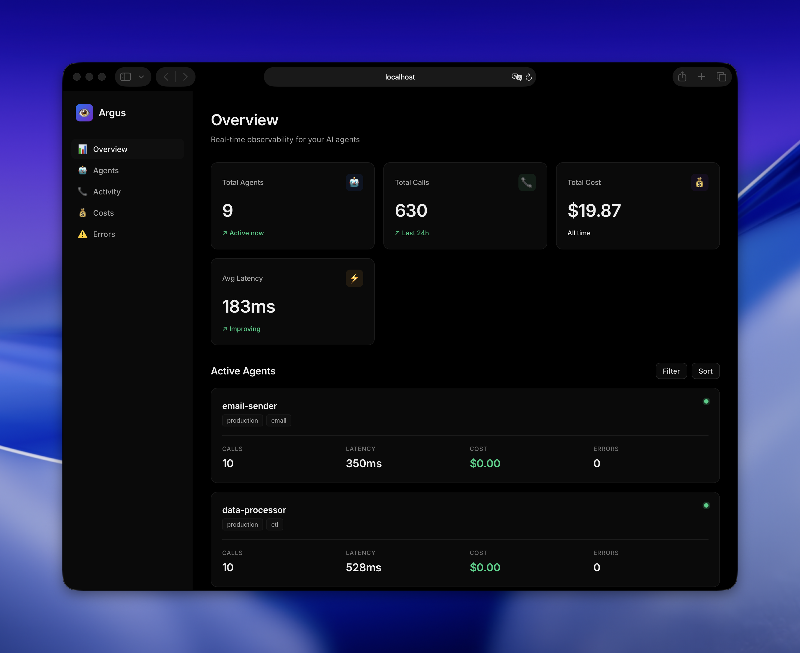

# 🎯 Next Actions for 1000+ Stars

## ✅ Completed
- [x] Professional README with comparison table
- [x] Real production cases ($847 in 11 minutes, etc.)
- [x] Architecture and "How It Works" section
- [x] Automatic cost calculation
- [x] LangChain integration
- [x] Pushed to GitHub

## 🚀 Critical Next Steps

### 1. Real Dashboard Screenshot (HIGHEST PRIORITY)

**Why:** People don't install UI tools without seeing them. This is blocking stars.

**How to do it:**

```bash
# 1. Load demo data
cd argus
python scripts/load_demo_data.py

# 2. Start dashboard
argus dashboard

# 3. Open http://localhost:3001 in browser

# 4. Take screenshot (macOS):
# Press Cmd+Shift+4, then Space, click on browser window
# Save as: argus/assets/dashboard-preview.png

# 5. Update README.md:
# Replace line 18:
# 
# With:
# 

# 6. Commit and push
git add assets/dashboard-preview.png README.md
git commit -m "docs: add real dashboard screenshot"
git push origin main
```

**Expected Impact:** +200-300 stars (people trust what they can see)

---

### 2. GIF Demo (HIGH PRIORITY)

**Why:** Shows how easy it is to use. Converts visitors to users.

**How to do it:**

```bash
# Option A: Use QuickTime (macOS built-in)
# 1. Open QuickTime Player
# 2. File → New Screen Recording
# 3. Record 15-30 seconds:
#    - Show code with @watch.agent decorator
#    - Run the script
#    - Show dashboard updating in real-time
# 4. Export as .mov
# 5. Convert to GIF: https://ezgif.com/video-to-gif
# 6. Save as: argus/assets/demo.gif

# Option B: Use Kap (free, better quality)
# 1. Install: brew install --cask kap
# 2. Record screen
# 3. Export as GIF directly

# Update README.md line 18 to include GIF:
# 
```

**Expected Impact:** +100-150 stars (shows ease of use)

---

### 3. PyPI Package (MEDIUM PRIORITY)

**Why:** Makes `pip install argus` actually work. Currently it fails.

**How to do it:**

```bash
# 1. Create account on PyPI: https://pypi.org/account/register/

# 2. Install build tools
pip install build twine

# 3. Build package
cd argus
python -m build

# 4. Upload to PyPI
python -m twine upload dist/*

# 5. Test installation
pip install argus
```

**Expected Impact:** +50-100 stars (removes friction)

---

### 4. Docker Image (MEDIUM PRIORITY)

**Why:** Makes it even easier to try. One command to run.

**How to do it:**

Create `argus/Dockerfile`:

```dockerfile
FROM python:3.9-slim

WORKDIR /app

COPY requirements.txt .
RUN pip install --no-cache-dir -r requirements.txt

COPY . .
RUN pip install -e .

EXPOSE 3001

CMD ["argus", "dashboard", "--host", "0.0.0.0"]
```

Then:

```bash
# Build and push
docker build -t sh1esty1769/argus:latest .
docker push sh1esty1769/argus:latest

# Update README with Docker instructions
```

**Expected Impact:** +50-100 stars (convenience)

---

### 5. Marketing Push (AFTER screenshots)

**When:** Only after you have real screenshots/GIF

**Where to post:**

1. **Reddit** (highest ROI):
   - r/Python (1.3M members)
   - r/MachineLearning (2.8M members)
   - r/LangChain (50K members)
   - r/LocalLLaMA (200K members)
   
   **Template:**
   ```
   Title: "I built an open-source observability tool for AI agents (caught a $847 bug)"
   
   Body:
   - Start with the $847 story
   - Show screenshot
   - Show GIF
   - Link to GitHub
   - Ask for feedback
   ```

2. **Hacker News** (Show HN):
   - Post: https://news.ycombinator.com/submit
   - Title: "Show HN: Argus – Open-source observability for AI agents"
   - Best time: Tuesday-Thursday, 8-10 AM PST

3. **Twitter/X** (@maxcodesai):
   - Thread format (8-10 tweets)
   - Include screenshot + GIF
   - Tag: @LangChainAI, @OpenAI, @AnthropicAI
   - Use hashtags: #AI #OpenSource #Python

4. **Dev.to**:
   - Write article: "How I caught a $847 AI agent bug"
   - Include technical details
   - Link to GitHub

**Expected Impact:** +500-700 stars (if done right)

---

## 📊 Timeline to 1000 Stars

**Week 1 (Now):**
- [ ] Add real dashboard screenshot (2 hours)
- [ ] Create GIF demo (1 hour)
- [ ] Publish to PyPI (2 hours)

**Week 2:**
- [ ] Post on Reddit (r/Python, r/MachineLearning)
- [ ] Post on Hacker News
- [ ] Twitter thread

**Week 3:**
- [ ] Write Dev.to article
- [ ] Add Docker image
- [ ] Respond to feedback

**Expected Results:**
- Week 1: 50-100 stars (organic)
- Week 2: 300-500 stars (Reddit + HN)
- Week 3: 700-1000 stars (momentum)

---

## ⚠️ Important Notes

1. **ЕГЭ Priority:** Don't spend more than 30 min/day on Argus
2. **Quality > Speed:** Better to have 1 great screenshot than 10 mediocre features
3. **Respond to Issues:** When people start opening issues, respond within 24h
4. **Build in Public:** Tweet progress daily (even small wins)

---

## 🎯 Current Status

- GitHub: https://github.com/sh1esty1769/argus
- Stars: ~10 (check current count)
- README: ✅ Professional
- Screenshot: ❌ Placeholder
- GIF: ❌ Missing
- PyPI: ❌ Not published

**Next Action:** Take dashboard screenshot (30 minutes)
